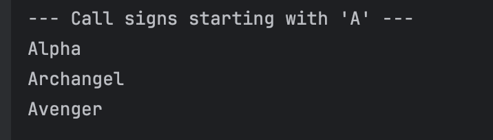

# Exploring Java Lamdas and Predicate

**Name:** Andre Dominic Ha Lacra

---

## Output Screenshots and Explanations per Exercise

---

### Exercise 1: The "New Way" - A Simple Lambda Expression

**Prediction**  
The output will evaluate the `Predicate` to check if each string’s length exceeds 10 characters. For `"short"`, `isLong.test()` returns `false` because its length is 5. For `"This is a very long string"`, it returns `true` because the length is well above 10.

**Observation**  
```
Is 'short' long? false
Is 'This is a very long string' long? true
```

**Output Screenshot:**  


---

### Exercise 2: Using Predicates to Filter a List

**Prediction**  
This program creates a list of call signs and uses a lambda-based `Predicate` to filter those that start with the letter `"A"`. The `filterAndPrint` method iterates over the list, applies the predicate’s `test()` method to each element, and prints only those that meet the condition. As a result, the output lists `"Alpha"`, `"Archangel"`, and `"Avenger"` under the heading `"Call signs starting with 'A'"`, since these are the only entries that satisfy the `startsWith("A")` check.

**Observation**  
```
--- Call signs starting with 'A' ---
Alpha
Archangel
Avenger
```

**Output Screenshot:**  


---

### Exercise 3: Chaining Predicates (`and`, `negate`)

**Prediction**  
This code output builds based on the earlier predicates by creating a compound condition that checks if a call sign starts with `"A"` **and** has a length greater than 5. Using `and()`, the program filters and prints only `"Archangel"` and `"Avenger"`, as they satisfy both requirements. It then defines another predicate using `negate()` to find call signs that do **not** start with `"A"`, printing `"Bravo"` and `"Echo"` as the results.

**Observation**  
```
--- Starts with 'A' AND length > 5 ---
Archangel
Avenger

--- Does NOT start with 'A' ---
Bravo
Echo
```

**Output Screenshot:**  


---
